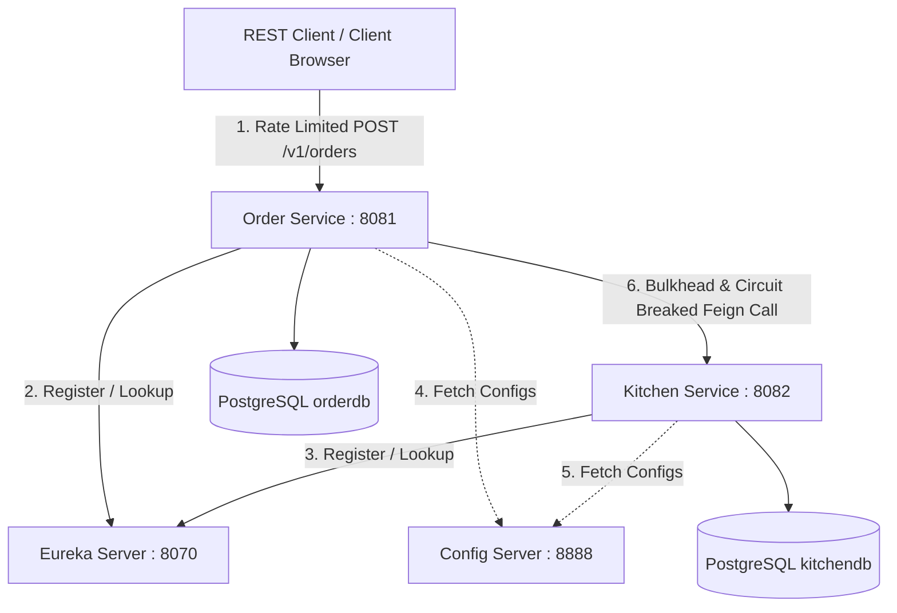
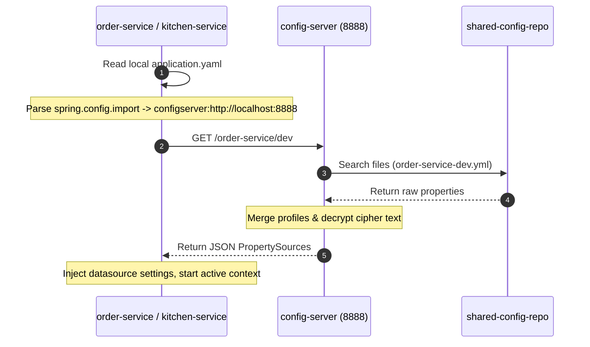
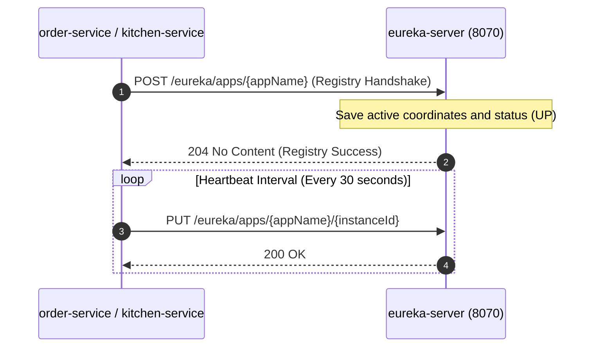
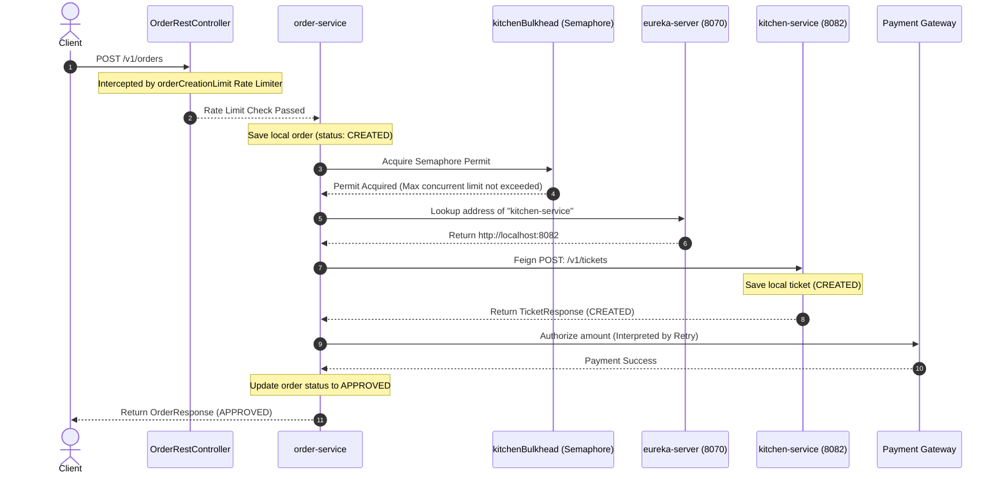
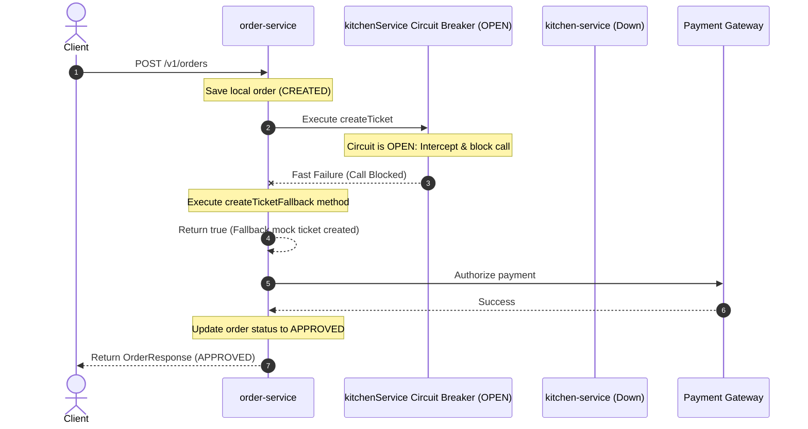
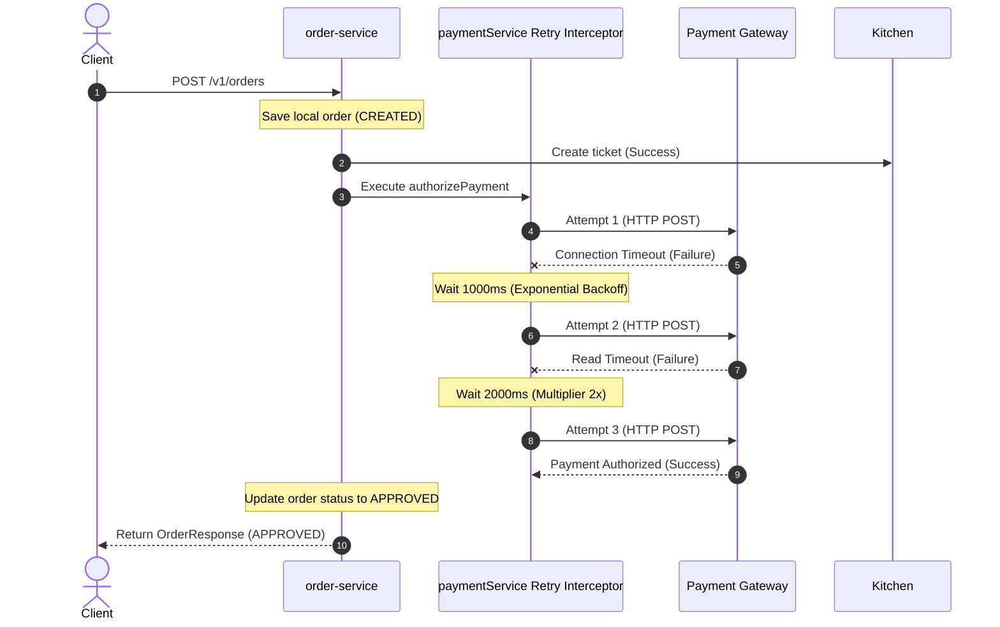

# FTGO Microservices: API Endpoints, Core Flows & Resilience Guide

This document maps out the system topology, API contracts, boot sequences, registration schedules, eventual consistency flows (Saga Pattern), and **Resilience4j boundaries** (Circuit Breakers, Retries, Bulkheads, Rate Limiters, and TimeLimiters) across the **`ftgo-microservices`** workspace.

---

## 1. What the Project Does

The application represents a reference architecture for food delivery ordering, restaurant ticketing, dynamic configuration, and discovery management:
1. **Centralized Configuration**: The `config-server` serves environment properties (connection ports, database URLs, Eureka zones) from a shared directory (`shared-config-repo`).
2. **Service Discovery**: The `eurekaserver` acts as a coordinator, tracking host names/IP addresses and mapping logical microservice names.
3. **Dynamic Outbound Call Routing**: Microservices use OpenFeign to invoke target endpoints without hardcoding IP addresses or ports, dynamically querying Eureka to locate instances.
4. **Distributed Saga Transaction**: Orchestrates complex order placements across multiple services. If a middle step (e.g. payment authorization) fails, it executes compensating operations (e.g. ticket cancellation) to roll back downstream changes.
5. **Fault Tolerance & Isolation**: Employs Resilience4j to prevent cascading timeouts, rate limit excessive traffic, retry transient network anomalies, and fallback gracefully when downstream components crash.

---

## 2. System Topology & Port Mapping



---

## 3. Inbound API Endpoints Reference

### 3.1 Order Service (`order-service` : Port `8081`)

Exposes REST endpoints to place and monitor customer checkouts:

1. **Create Order** (`POST /v1/orders`):
   * **Resilience Policy**: Protected by the **`orderCreationLimit` Rate Limiter** (Limits requests to 50 calls per second; excess calls are rejected immediately with a `429 Too Many Requests` equivalent).
   * **Location**: `com.chibao.orderservice.infrastructure.adapters.inbound.controller.OrderRestController`
   * **Body Payload (`OrderCreateRequest`)**:
     ```json
     {
       "consumerId": "consumer_99",
       "restaurantId": "restaurant_01",
       "totalAmount": 34.50,
       "items": [
         { "menuItemId": "pizza_margherita", "quantity": 2 }
       ]
     }
     ```
   * **Workflow**: Saves order as `CREATED` locally. Requests kitchen validation from `kitchen-service` and calls payment verification. Upon confirmation, transitions state to `APPROVED`. If validation or payment fails, transitions to `REJECTED`.
   * **Response Payload (`OrderResponse`)**:
     ```json
     {
       "id": "4b9e28ac-1a3b-4cde-8e9f-524bc109f291",
       "status": "APPROVED",
       "totalAmount": 34.50
     }
     ```

2. **Get Order Details** (`GET /v1/orders/{orderId}`):
   * **Response Payload (`OrderResponse`)**: Mapped to database state.

---

### 3.2 Kitchen Service (`kitchen-service` : Port `8082`)

Exposes REST endpoints to manage and retrieve food preparation tickets:

1. **Create Ticket** (`POST /v1/tickets`):
   * **Location**: `com.chibao.kitchenservice.infrastructure.adapters.inbound.controller.TicketRestController`
   * **Body Payload (`TicketCreateRequest`)**:
     ```json
     {
       "id": "4b9e28ac-1a3b-4cde-8e9f-524bc109f291",
       "orderId": "4b9e28ac-1a3b-4cde-8e9f-524bc109f291",
       "restaurantId": "restaurant_01"
     }
     ```
   * **Workflow**: Creates a food ticket, schedules target preparation time (+30 min), persists to `kitchendb`, and registers state as `CREATED`.
   * **Response Payload (`TicketResponse`)**:
     ```json
     {
       "id": "4b9e28ac-1a3b-4cde-8e9f-524bc109f291",
       "orderId": "4b9e28ac-1a3b-4cde-8e9f-524bc109f291",
       "state": "CREATED"
     }
     ```

2. **Get Ticket Details** (`GET /v1/tickets/{ticketId}`):
   * **Response Payload (`TicketResponse`)**: Mapped to database ticket state.

---

### 3.3 Config Server (`config-server` : Port `8888`)

Distributes centralized properties to microservices:

1. **Fetch Configuration Profile** (`GET /{application}/{profile}`):
   * **Workflow**: Config Server parses `shared-config-repo/` for properties matching `{application}-{profile}.yml` and returns a flat key-value payload.

---

### 3.4 Eureka Server (`eureka-server` : Port `8070`)

Hosts dashboard and API query registry endpoint:

1. **Dashboard Interface** (`GET /`): Access via browser to check registry dashboard.
2. **Registry Lookup** (`GET /eureka/apps`): Lists XML/JSON coordinates of all active registered clients.

---

## 4. End-to-End Core System Flows

### 4.1 Bootstrap Configuration Fetch Flow

During startup, microservice context initialization queries `config-server` before starting the database or web listener:



---

### 4.2 Service Discovery Registration Flow

Active services register coordinates with Eureka and maintain connection status via heartbeats:



---

### 4.3 Saga Order Placement with Resilience Boundaries

The sequence diagrams below detail how the business flow changes when Resilience4j interceptors protect API paths.

#### Flow A: Successful Checkout with Rate Limiter and Bulkhead Active

Incoming orders must first acquire a Rate Limiter permit. When executing outbound calls, the thread must pass through a Semaphore Bulkhead to limit concurrent requests.



---

#### Flow B: Downstream Crash Intercepted by Circuit Breaker & Fallback

If `kitchen-service` crashes, the Circuit Breaker trips to `OPEN`, immediately returning a cached/mocked ticket fallback state and allowing the Saga to process order creation without failing.



---

#### Flow C: Transient Network Failure Recovered by Retry

When the Payment Gateway experiences short network timeouts, the **Retry** interceptor automatically restarts the payment transaction with exponential backoff delays.


