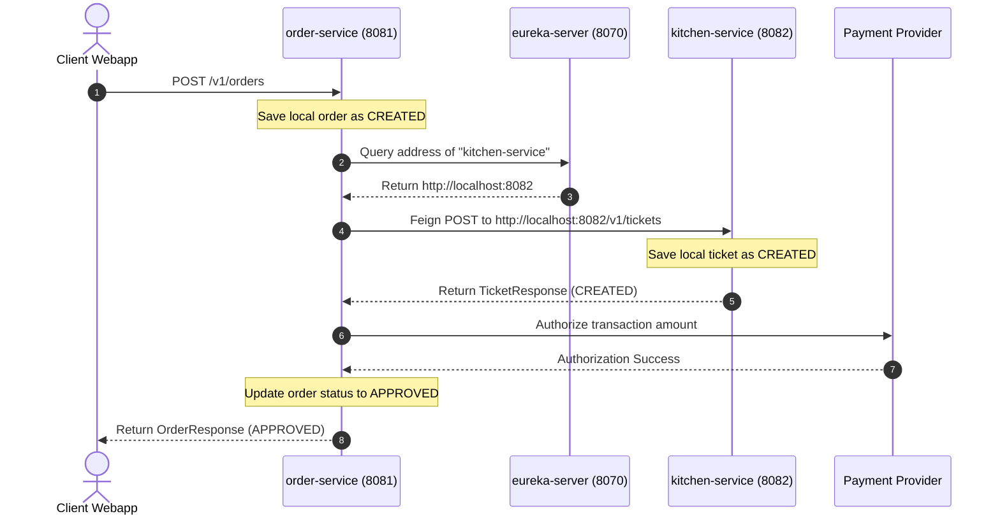

# FTGO Microservices Architecture & Flow Directory

FTGO Microservices is a food delivery reference platform designed to demonstrate modern cloud patterns. It showcases **Hexagonal Architecture (Ports and Adapters)**, **Centralized Configuration Management**, **Dynamic Service Discovery (Netflix Eureka)**, and **Eventual Consistency Orchestration (Saga Pattern)** across distributed database bounds.

---

## 1. What Does the Project Do?

The application orchestrates the lifecycle of food delivery orders from initial placement to restaurant confirmation and payment processing:
1. **Centralized Configurations**: The `config-server` bootstraps application settings dynamically from a shared property repository (`shared-config-repo`), injecting database credentials and ports at startup.
2. **Service Discovery**: The `eurekaserver` acts as a central phonebook. All active microservice instances register their address and port, allowing load-balanced calls via OpenFeign without hardcoded URLs.
3. **Order Lifecycle Saga**: The `order-service` handles client orders. It coordinates ticket validation with `kitchen-service` and payment verification with a payment gateway. If any step fails, it initiates compensating rollbacks to maintain system integrity.

---

## 2. API Reference Directory

### 2.1 Order Service (`order-service` : Port `8081`)

Provides endpoints to manage order placements and retrieve checkout logs.

#### 1. Create Order
* **Endpoint**: `POST /v1/orders`
* **Request Header**: `Content-Type: application/json`
* **Request Body (`OrderCreateRequest`)**:
  ```json
  {
    "consumerId": "consumer_99",
    "restaurantId": "restaurant_01",
    "totalAmount": 34.50,
    "items": [
      { "menuItemId": "pizza_margherita", "quantity": 2 }
    ]
  }
  ```
* **How it works**: Initiates the Order Placement Saga. First, it registers a `CREATED` order in Postgres. Then, it contacts `kitchen-service` to verify ticket creation and requests payment authorization. If both succeed, the order transitions to `APPROVED`. If any step fails, the order transitions to `REJECTED`.
* **Response Payload (`OrderResponse`)**:
  ```json
  {
    "id": "4b9e28ac-1a3b-4cde-8e9f-524bc109f291",
    "status": "APPROVED",
    "totalAmount": 34.50
  }
  ```

#### 2. Get Order Details
* **Endpoint**: `GET /v1/orders/{orderId}`
* **How it works**: Performs a direct query against `orderdb` using the order UUID key and returns its active state (`CREATED`, `APPROVED`, or `REJECTED`).
* **Response Payload (`OrderResponse`)**:
  ```json
  {
    "id": "4b9e28ac-1a3b-4cde-8e9f-524bc109f291",
    "status": "APPROVED",
    "totalAmount": 34.50
  }
  ```

---

### 2.2 Kitchen Service (`kitchen-service` : Port `8082`)

Manages restaurant ticket preparation times and coordinates kitchen operations.

#### 1. Create Ticket
* **Endpoint**: `POST /v1/tickets`
* **Request Body (`TicketCreateRequest`)**:
  ```json
  {
    "id": "4b9e28ac-1a3b-4cde-8e9f-524bc109f291",
    "orderId": "4b9e28ac-1a3b-4cde-8e9f-524bc109f291",
    "restaurantId": "restaurant_01"
  }
  ```
* **How it works**: Invoked by the order-service during the placement saga. Kitchen service verifies restaurant availability, schedules a chef preparation ticket, sets a default target ready time (+30 minutes), saves it to `kitchendb`, and registers the ticket as `CREATED`.
* **Response Payload (`TicketResponse`)**:
  ```json
  {
    "id": "4b9e28ac-1a3b-4cde-8e9f-524bc109f291",
    "orderId": "4b9e28ac-1a3b-4cde-8e9f-524bc109f291",
    "state": "CREATED"
  }
  ```

#### 2. Get Ticket Details
* **Endpoint**: `GET /v1/tickets/{ticketId}`
* **How it works**: Queries `kitchendb` using the ticket ID key to retrieve ticket details and status.
* **Response Payload (`TicketResponse`)**:
  ```json
  {
    "id": "4b9e28ac-1a3b-4cde-8e9f-524bc109f291",
    "orderId": "4b9e28ac-1a3b-4cde-8e9f-524bc109f291",
    "state": "CREATED"
  }
  ```

---

### 2.3 Config Server (`config-server` : Port `8888`)

Exposes Spring Cloud Config Server endpoints to distribute properties to clients.

#### 1. Fetch Configuration Profile
* **Endpoint**: `GET /{application}/{profile}` (e.g., `GET /order-service/dev`)
* **How it works**: The Config Server searches the native repository path (`shared-config-repo/`) for files matching `{application}-{profile}.yml` (e.g., `order-service-dev.yml`). It merges standard fallback values from `{application}.yml` and returns a mapped key-value property tree.
* **Response Payload**:
  ```json
  {
    "name": "order-service",
    "profiles": ["dev"],
    "propertySources": [
      {
        "name": "file:///shared-config-repo/order-service-dev.yml",
        "source": {
          "spring.datasource.url": "jdbc:postgresql://localhost:5431/orderdb",
          "eureka.client.service-url.defaultZone": "http://localhost:8070/eureka/"
        }
      }
    ]
  }
  ```

---

### 2.4 Eureka Server (`eureka-server` : Port `8070`)

Provides service registry interfaces for registration, discovery lookup, and health checking.

#### 1. Eureka Dashboard
* **Endpoint**: `GET /` (Access via browser at `http://localhost:8070/`)
* **How it works**: Renders a graphical dashboard monitoring active microservice instances, system status, JVM memory load, and registration metadata.

#### 2. Retrieve Application Registry
* **Endpoint**: `GET /eureka/apps`
* **How it works**: Exposes the complete active registry payload (XML or JSON) describing all registered instances, their active status (`UP`), hostnames, IP addresses, and operational ports. Used by client load balancers to route calls.

---

## 3. End-to-End Transaction Flow (Saga Pattern)

The diagram below details the happy path sequence (successful checkout) and shows how Eureka is queried to resolve Feign URLs:


