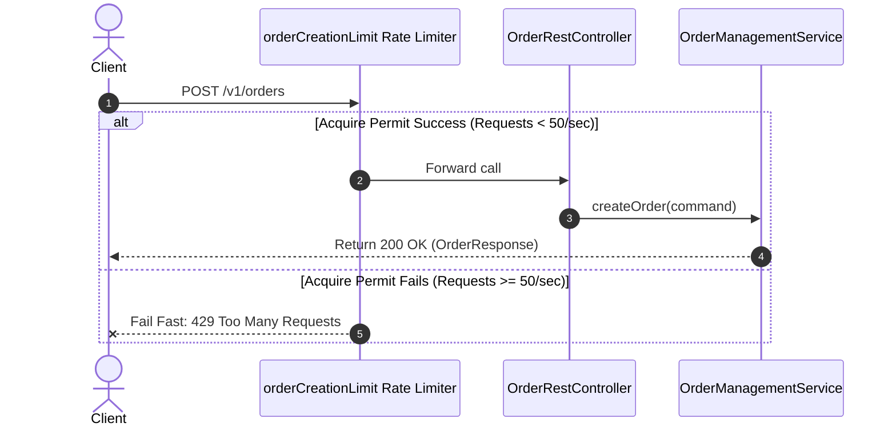
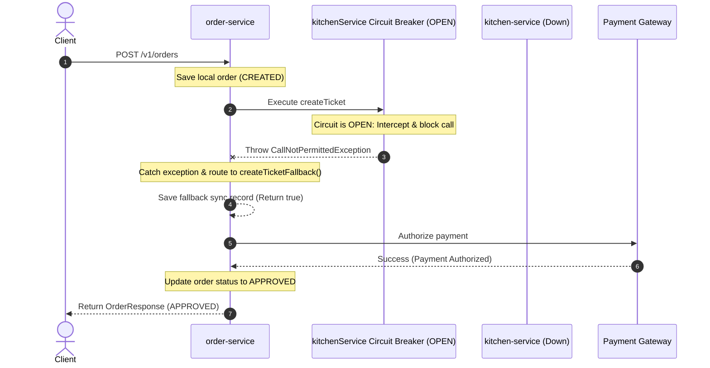
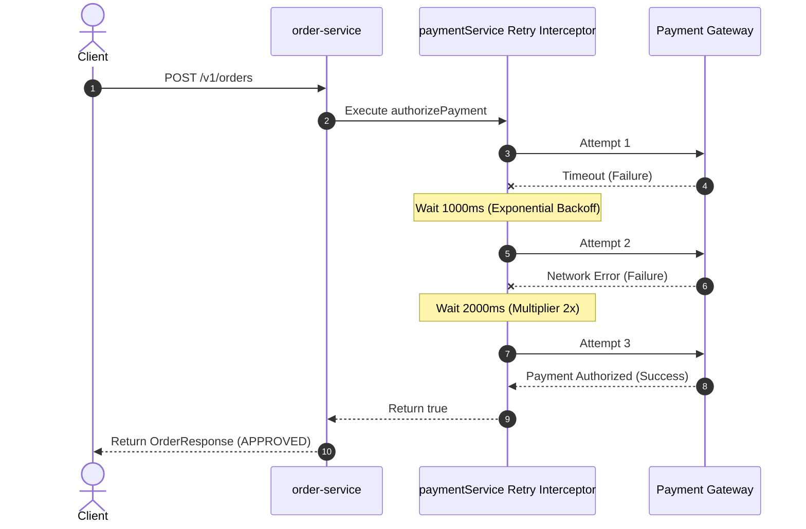
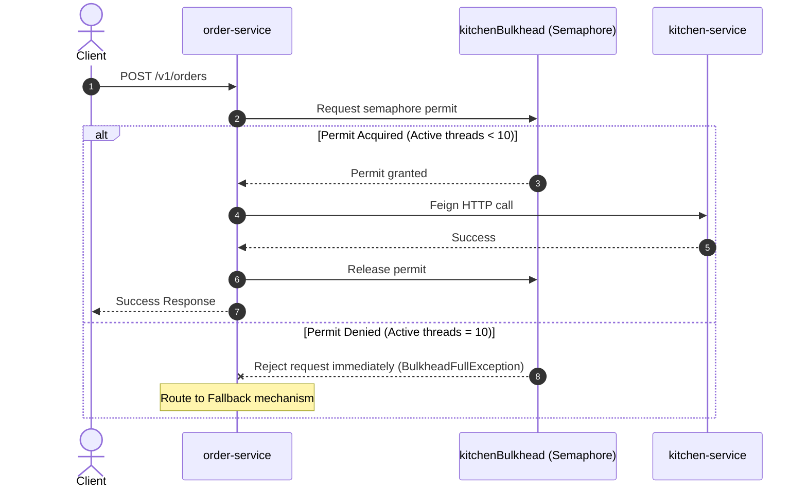
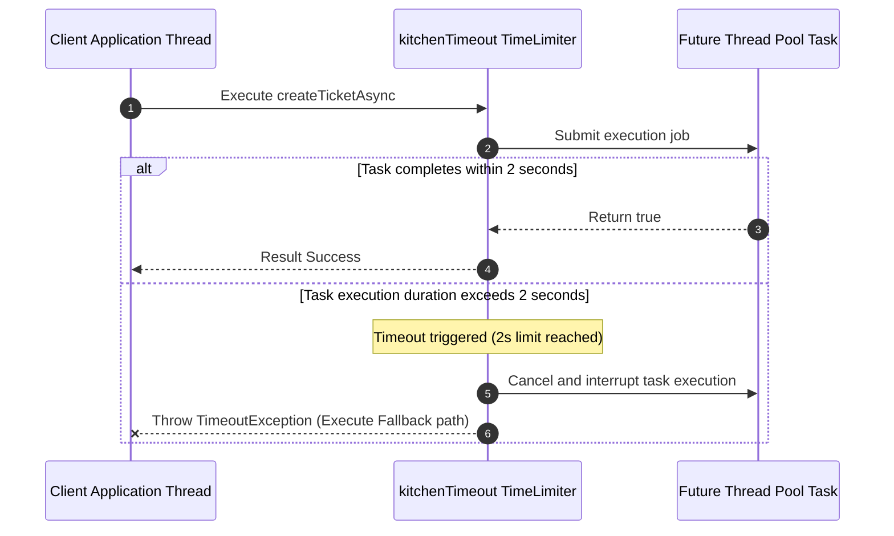

# Architecting Resilience: Resilience4j Design Guide for FTGO Microservices

Distributed architectures are vulnerable to cascading failures. If a single microservice runs slowly or goes offline, calling services can quickly exhaust their thread pools waiting for responses, bringing down the entire application. 

This guide details how to apply **Resilience4j** patterns inside the **`ftgo-microservices`** workspace, mapped directly to the actual API flows of the system.

---

## 1. Resilience Patterns Matrix

| Pattern | Goal | Where to Apply (Target Class) | Why There? |
| :--- | :--- | :--- | :--- |
| **Rate Limiter** | Restricts incoming traffic to prevent server overload or DoS attempts. | `com.chibao.orderservice.infrastructure.adapters.inbound.controller.OrderRestController` | Protects the API entry point `POST /v1/orders` from traffic spikes. |
| **Circuit Breaker** | Stops invoking a downstream dependency once error thresholds are exceeded. | `com.chibao.orderservice.infrastructure.adapters.outbound.clients.KitchenClientAdapter` | Prevents order placement threads from block-waiting when `kitchen-service` is down. |
| **Fallback** | Provides alternative code execution paths when a service fails. | `com.chibao.orderservice.infrastructure.adapters.outbound.clients.KitchenClientAdapter` | Lets the Order Placement Saga complete with status `PENDING` rather than crashing with a 500 error. |
| **Retry** | Automatically re-issues failed requests for transient faults. | `com.chibao.orderservice.infrastructure.adapters.outbound.clients.PaymentClientAdapter` | Recovers from network blips or timeouts when communicating with external Payment Providers. |
| **Bulkhead** | Restricts concurrent threads allocated to a specific outbound call path. | `com.chibao.orderservice.infrastructure.adapters.outbound.clients.KitchenClientAdapter` | Limits resources consumed by `kitchen-service` requests, ensuring `order-service` stays responsive. |
| **TimeLimiter** | Enforces a hard execution timeout on asynchronous calls. | Asynchronous Client Adapters | Automatically cancels long-running CompletableFuture tasks if they exceed time ceilings. |

---

## 2. API Flow Protection & Code Explanations

### 2.1 Inbound Protection: Rate Limiting on Order Creation

#### Where to Apply:
The entry controller endpoint `POST /v1/orders` in `com.chibao.orderservice.infrastructure.adapters.inbound.controller.OrderRestController`.

#### Why Apply There:
To protect downstream relational databases and network layers from being overwhelmed during flash sales or traffic spikes.

#### Execution Flow Diagram:


#### Code Explanation:
```java
@RestController
@RequestMapping("/v1/orders")
public class OrderRestController {
    private final OrderManagementUseCase useCase;

    @PostMapping
    @RateLimiter(name = "orderCreationLimit")
    public OrderResponse createOrder(@Valid @RequestBody OrderCreateRequest dto) {
        OrderResult result = useCase.createOrder(OrderControllerMapper.toCommand(dto));
        return OrderControllerMapper.toResponse(result);
    }
}
```

##### Accompanying YAML Configuration (in `order-service-dev.yml`):
```yaml
resilience4j:
  ratelimiter:
    instances:
      orderCreationLimit:
        limitForPeriod: 50          # Limit to 50 requests
        limitRefreshPeriod: 1s      # Reset request bucket every second
        timeoutDuration: 0ms        # Reject immediately if limit is exceeded
```

---

### 2.2 Outbound Protection: Circuit Breaker & Fallback on Ticket Creation

#### Where to Apply:
Outbound adapter interface in `com.chibao.orderservice.infrastructure.adapters.outbound.clients.KitchenClientAdapter` which calls the `/v1/tickets` endpoint of `kitchen-service`.

#### Why Apply There:
If `kitchen-service` is down or slow, the Circuit Breaker trips to `OPEN` state, avoiding socket connection timeouts. The Fallback method is immediately called to register a local pending outbox state, allowing the user's order to be processed locally instead of throwing a system crash.

#### Execution Flow Diagram (Downstream Crash):


#### Code Explanation:
```java
@Component
public class KitchenClientAdapter implements KitchenClient {
    private final KitchenFeignClient kitchenFeignClient;

    public KitchenClientAdapter(KitchenFeignClient kitchenFeignClient) {
        this.kitchenFeignClient = kitchenFeignClient;
    }

    @Override
    @CircuitBreaker(name = "kitchenService", fallbackMethod = "createTicketFallback")
    public boolean createTicket(String orderId, String restaurantId) {
        TicketCreateRequest request = new TicketCreateRequest(orderId, orderId, restaurantId);
        kitchenFeignClient.createTicket(request);
        return true;
    }

    // Fallback method must have the same arguments plus the leading Exception/Throwable parameter
    public boolean createTicketFallback(String orderId, String restaurantId, Throwable t) {
        System.err.println("kitchen-service is offline. Triggering fallback. Exception: " + t.getMessage());
        // Fallback action: return true to let order creation proceed, 
        // and register a background synchronization record in the database.
        return true;
    }
}
```

##### Accompanying YAML Configuration (in `order-service-dev.yml`):
```yaml
resilience4j:
  circuitbreaker:
    instances:
      kitchenService:
        slidingWindowType: COUNT_BASED
        slidingWindowSize: 10          # Monitor the last 10 requests
        failureRateThreshold: 50       # Trip to OPEN if 50% of the last 10 requests fail
        waitDurationInOpenState: 10s   # Keep the circuit OPEN for 10 seconds before transitioning to HALF-OPEN
```

---

### 2.3 Transient Protection: Retry on Payment Authorization

#### Where to Apply:
External gateways in `com.chibao.orderservice.infrastructure.adapters.outbound.clients.PaymentClientAdapter`.

#### Why Apply There:
External payment microservices or gateways are prone to transient failures (socket resets, temporary connection loss). Automatic retries with exponential backoff delay resolve these issues on the fly without displaying an error page to the customer.

#### Execution Flow Diagram (Temporary Timeout Recovery):


#### Code Explanation:
```java
@Component
public class PaymentClientAdapter implements PaymentClient {

    @Override
    @Retry(name = "paymentService", fallbackMethod = "authorizePaymentFallback")
    public boolean authorizePayment(String consumerId, double amount) {
        System.out.println("Processing payment for consumer: " + consumerId + " amount: " + amount);
        // Under-the-hood call to payment provider...
        return true;
    }

    public boolean authorizePaymentFallback(String consumerId, double amount, Throwable t) {
        System.err.println("All 3 payment retries failed. Declining checkout transaction.");
        return false;
    }
}
```

##### Accompanying YAML Configuration (in `order-service-dev.yml`):
```yaml
resilience4j:
  retry:
    instances:
      paymentService:
        maxAttempts: 3                   # Attempt the call up to 3 times
        waitDuration: 1000ms              # Initial delay between retries
        enableExponentialBackoff: true
        exponentialBackoffMultiplier: 2   # Multiplies delay by 2x on each failure (1s -> 2s)
```

---

### 2.4 Thread Pool Isolation: Bulkhead on Ticket Scheduling

#### Where to Apply:
Downstream dependencies inside `com.chibao.orderservice.infrastructure.adapters.outbound.clients.KitchenClientAdapter`.

#### Why Apply There:
To protect `order-service` request threads from being monopolized by one slow downstream service. Setting a Semaphore Bulkhead caps the concurrent threads allowed to process ticket creations to a safe maximum (e.g. 10 threads). If `kitchen-service` stalls, only those 10 threads hang, leaving the rest of the application responsive for order cancellations or catalog lookups.

#### Execution Flow Diagram (Semaphore Acquisition):


#### Code Explanation:
```java
@Component
public class KitchenClientAdapter implements KitchenClient {

    @Override
    @Bulkhead(name = "kitchenBulkhead", type = Bulkhead.Type.SEMAPHORE)
    public boolean createTicket(String orderId, String restaurantId) {
        TicketCreateRequest request = new TicketCreateRequest(orderId, orderId, restaurantId);
        kitchenFeignClient.createTicket(request);
        return true;
    }
}
```

##### Accompanying YAML Configuration (in `order-service-dev.yml`):
```yaml
resilience4j:
  bulkhead:
    instances:
      kitchenBulkhead:
        maxConcurrentCalls: 10            # Cap concurrent requests to 10 threads
        maxWaitDuration: 500ms            # Wait up to 500ms to acquire a slot before throwing BulkheadFullException
```

---

### 2.5 Execution Cap: TimeLimiter on Asynchronous Queries

#### Where to Apply:
Outbound reactive or asynchronous methods returning java Futures or reactive streams.

#### Why Apply There:
Provides a hard duration ceiling. If an asynchronous query takes longer than the limit (e.g., 2 seconds), the TimeLimiter terminates execution and triggers the fallback path, protecting network sockets from hanging indefinitely.

#### Execution Flow Diagram (Execution Time Limit Exceeded):


#### Code Explanation:
```java
@Component
public class KitchenClientAdapter implements KitchenClient {

    @Override
    @TimeLimiter(name = "kitchenTimeout")
    public CompletableFuture<Boolean> createTicketAsync(String orderId, String restaurantId) {
        return CompletableFuture.supplyAsync(() -> {
            // Complex network request or long database query
            return true;
        });
    }
}
```

##### Accompanying YAML Configuration (in `order-service-dev.yml`):
```yaml
resilience4j:
  timelimiter:
    instances:
      kitchenTimeout:
        timeoutDuration: 2s               # Force terminate execution if it takes > 2 seconds
        cancelRunningFuture: true         # Interrupt the underlying running thread
```
