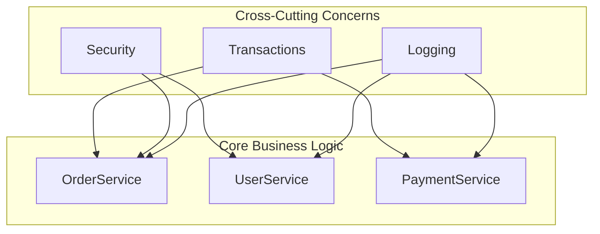
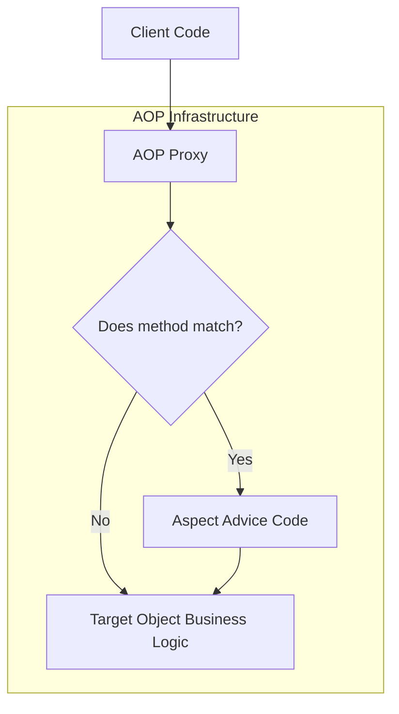
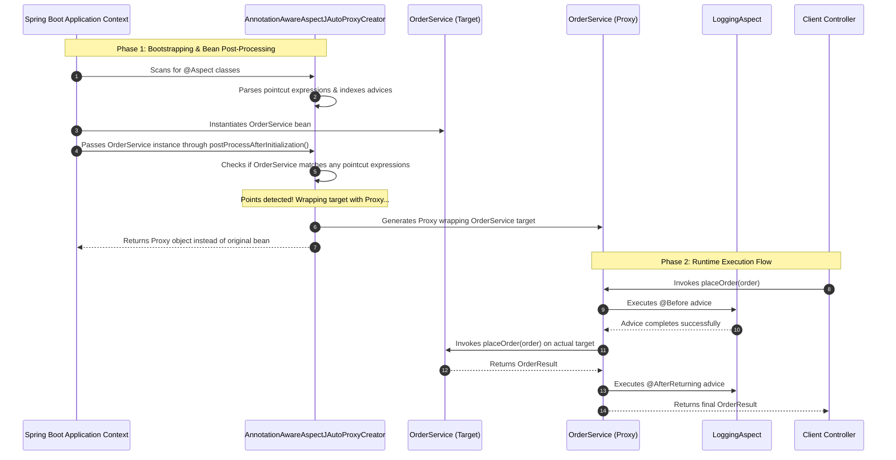
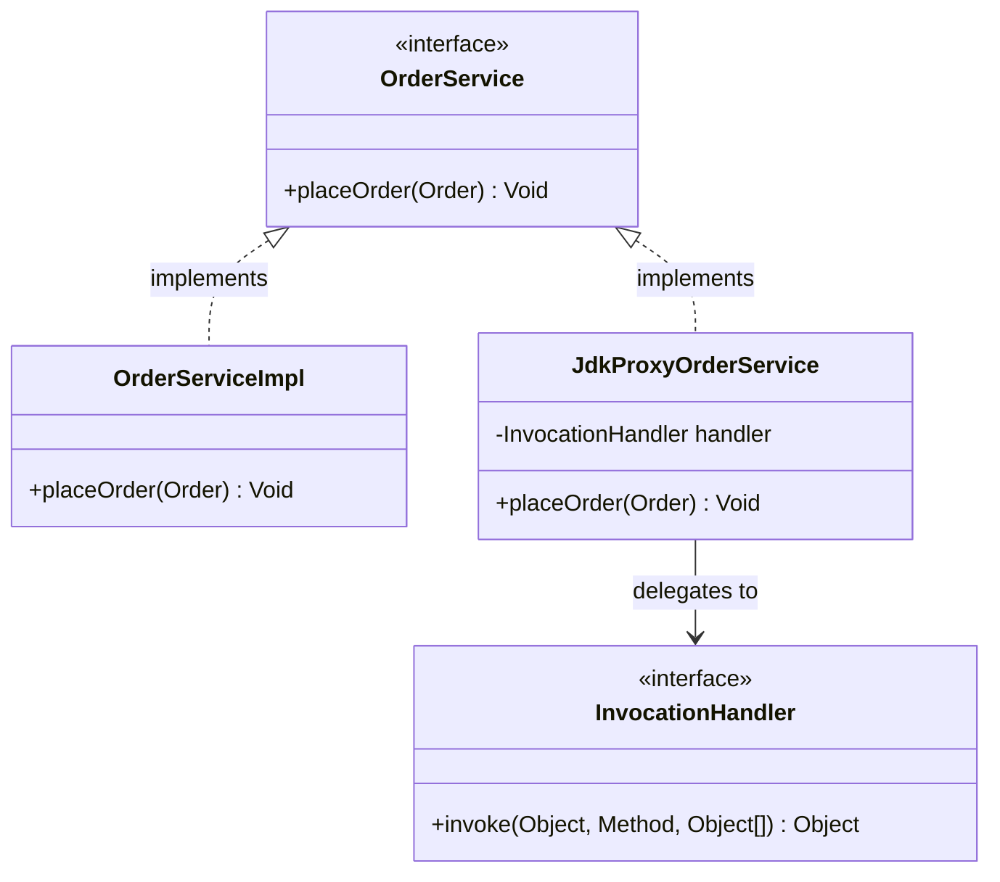
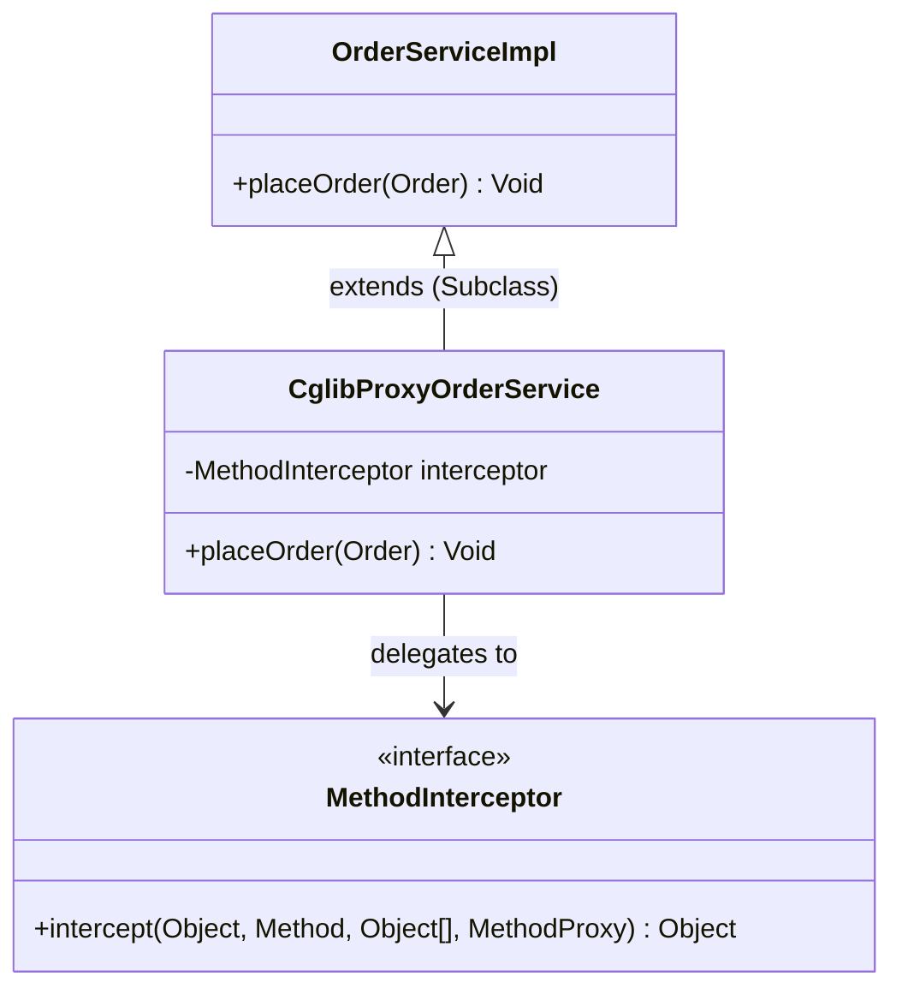
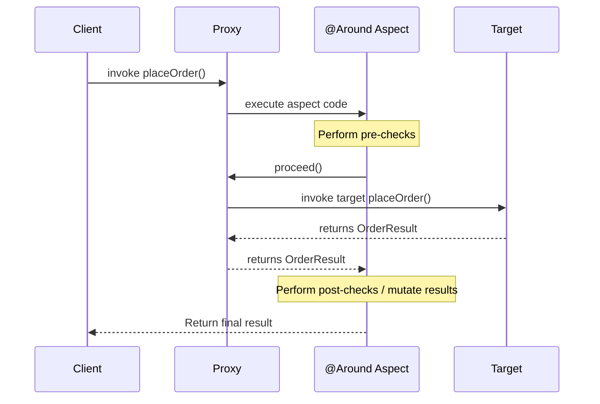
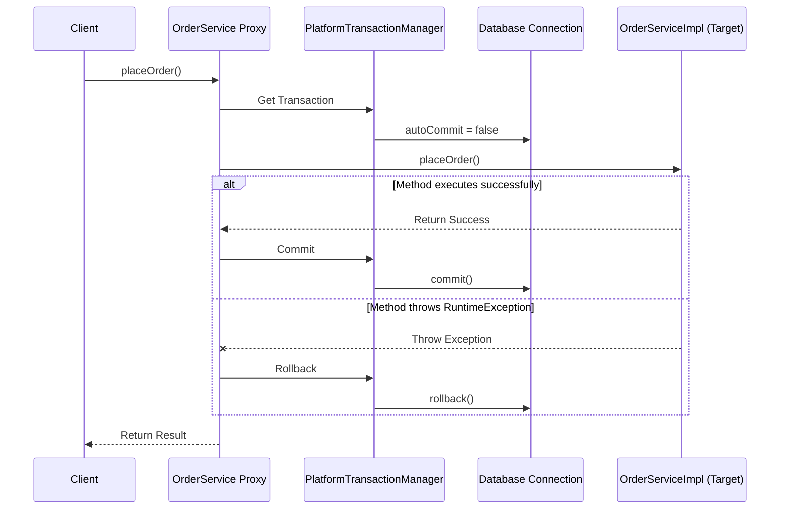
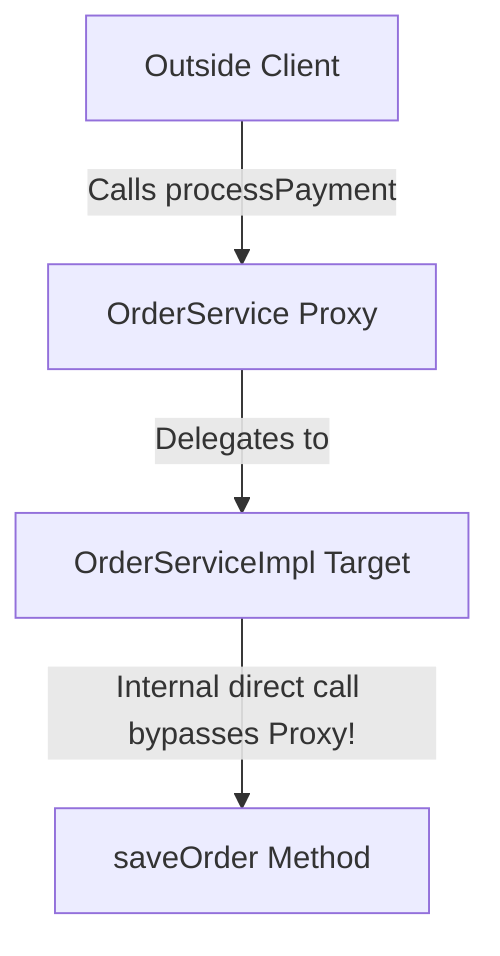

# The Ultimate Guide to Spring AOP: From Beginner to Advanced

Aspect-Oriented Programming (AOP) is one of the most powerful yet misunderstood features of the Spring Framework. This course is designed to take you from a complete beginner with no prior AOP knowledge to an advanced level where you understand Spring's proxy mechanics, pointcut expressions, advice lifecycle, transaction management, and common production pitfalls.

---

## Part 1 — Why Spring AOP Exists

### The Software Engineering Problem
In modern enterprise applications, we write business logic to fulfill core requirements—such as calculating order totals, checking inventory, or processing payments. This is the **Core Concern** of our application.

However, a production-grade application requires more than just core business logic. It also requires:
* **Logging:** Recording who did what and when.
* **Security/Authorization:** Ensuring the current user has permission to execute an action.
* **Transaction Management:** Guaranteeing that multiple database updates succeed or fail together.
* **Performance Monitoring:** Measuring method execution latency.
* **Validation:** Ensuring input parameters conform to business rules.
* **Auditing:** Writing permanent logs of sensitive state changes.

These secondary requirements are known as **Cross-Cutting Concerns** because they "cut across" multiple layers and modules of your application, as visualized below:



### The Limitations of Traditional Approaches
Before AOP, developers had to write code for these cross-cutting concerns manually inside every business method. 

#### Scenario: Manual Logging, Security, and Transaction Management
Consider this manual implementation of an order processing system:

```java
public class OrderService {
    private final OrderRepository repository;
    private final SecurityService securityService;
    private final TransactionManager transactionManager;
    private final Logger logger = Logger.getLogger(OrderService.class.getName());

    public OrderService(OrderRepository repository, SecurityService securityService, TransactionManager transactionManager) {
        this.repository = repository;
        this.securityService = securityService;
        this.transactionManager = transactionManager;
    }

    public void placeOrder(Order order) {
        // 1. Security/Authorization (Cross-cutting)
        if (!securityService.getCurrentUser().hasRole("CUSTOMER")) {
            throw new SecurityException("Unauthorized access!");
        }

        // 2. Logging (Cross-cutting)
        logger.info("Placing order for customer: " + order.getCustomerId());

        // 3. Transaction Boundary Management (Cross-cutting)
        TransactionStatus status = transactionManager.beginTransaction();
        try {
            // 4. CORE BUSINESS LOGIC
            repository.save(order);
            repository.updateInventory(order.getItems());

            // Commit Transaction (Cross-cutting)
            transactionManager.commit(status);
        } catch (Exception e) {
            // Rollback Transaction (Cross-cutting)
            transactionManager.rollback(status);
            logger.severe("Order placement failed: " + e.getMessage());
            throw e;
        }

        // 5. Auditing & Metrics (Cross-cutting)
        logger.info("Order successfully completed with ID: " + order.getId());
    }
}
```

#### Why This Traditional Code is Hard to Maintain
As an application grows to hundreds of services, this manual approach suffers from two severe design flaws:

1. **Code Tangling (Low Cohesion):** The `placeOrder` method is no longer focused on its primary responsibility (saving the order and updating inventory). Instead, it is tangled with security validation, logging APIs, transaction status codes, and exception handlings.
2. **Code Scattering (High Duplication):** The boilerplate security check, transaction blocks, and log calls are duplicated (scattered) across almost every service method in the system. If the logging format changes or the security check rule updates, you must manually edit hundreds of files.

### How Spring AOP Solves This
Spring AOP decouples these cross-cutting concerns from your core business logic. It allows you to write the cross-cutting logic in a single place (an **Aspect**) and declare where it should be executed. Spring then automatically intercepts method calls at runtime and executes the logic without modifying your original Java class.

---

## Part 2 — Introduction to AOP

To master AOP, you must learn its vocabulary. We will build this vocabulary through a real-world analogy: **A Security Guard at a Secured Building**.

### 1. Aspect
* **Analogy:** The Security Guard itself. The guard contains all the rules and procedures for checking badges and scanning luggage.
* **Definition:** A modularized class that encapsulates a cross-cutting concern (e.g., Logging, Transactions).
* **Code Example:**
  ```java
  @Aspect
  @Component
  public class SecurityAspect {
      // Aspect implementation here
  }
  ```

### 2. Join Point
* **Analogy:** Any door or hallway in the building where a security check *could* potentially be placed.
* **Definition:** A point during the execution of a program (such as a method execution, exception handler, or field modification) where an aspect can be plugged in. 
  > [!IMPORTANT]
  > In Spring AOP, a Join Point **always** represents a **method execution**.

### 3. Pointcut
* **Analogy:** The specific instructions telling the guard: *"Only stand at the main entrance door and check badges there."*
* **Definition:** An expression that selects a specific subset of Join Points (methods) to intercept. It filters method calls based on package name, class name, method name, modifiers, or annotations.
* **Code Example:**
  ```java
  @Pointcut("execution(* com.example.service.*.*(..))")
  public void serviceMethods() {}
  ```

### 4. Advice
* **Analogy:** The action the guard takes when someone arrives at the door (e.g., *"Check badge before they enter"* or *"Scan badge after they exit"*).
* **Definition:** The actual action taken by an Aspect at a particular Join Point. It represents the code that runs when a pointcut match occurs.
* **Code Example:**
  ```java
  @Before("serviceMethods()")
  public void verifyUser() {
      System.out.println("Checking user permissions...");
  }
  ```

### 5. Target Object (The original business class)
* **Analogy:** The employee who is trying to walk through the security door to do their job.
* **In Simple Words:** Think of the Target Object as the original Java class that contains your actual business logic (for example, `OrderService` which saves orders to the database). It is the class that we want to add extra features to (like logging or security) *without* modifying its code. We call it "Target" because it is the target of our decorations/aspects.

### 6. AOP Proxy
* **Analogy:** A security escort who walks alongside the employee and intercepts all interactions with them.
* **Definition:** An object created by the Spring AOP framework to implement the aspect contract. It wraps the target object and executes the advice before/after delegating to the target object.

### 7. Weaving
* **Analogy:** Installing the security checkpoint framework at building doors.
* **Definition:** The process of linking aspects with other application types or objects to create an advised object. Spring AOP performs weaving at **runtime** using dynamic proxies.

---

### Object Relationship Diagram
The diagram below shows how these concepts fit together at runtime:



---

## Part 3 — How Spring AOP Works (Under the Hood)

Let's trace exactly how Spring configures, detects, and executes AOP code step-by-step from startup to runtime.



### Detailed Breakdown of Execution Phases

#### Phase 1: Context Initialization (Startup)
1. **Spring Scans Classes:** The Application Context starts and scans the classpath for classes annotated with `@Component` and `@Aspect`.
2. **Aspect Annotation Processing:** A special post-processor called `AnnotationAwareAspectJAutoProxyCreator` detects aspect classes and registers their Pointcuts and Advices.
3. **Bean Creation:** Spring instantiates target objects (e.g. `OrderService`).
4. **Post-Processing & Proxying:** Before the bean is returned to the container, it is passed to the `BeanPostProcessor` lifecycle phase. The proxy creator checks if any pointcut matches the target bean. If a match occurs, Spring dynamically generates a proxy class wrapping the target and returns this proxy bean instead of the original target.

#### Phase 2: Runtime Interception
1. **Dependency Injection:** The Client controller (which declared a dependency on `OrderService`) is injected with the **Proxy** object, not the original target bean.
2. **Method Call Interception:** The client calls `orderService.placeOrder(order)`. This call is received by the proxy.
3. **Advice Evaluation:** The proxy determines which advices apply to this specific method call.
4. **Advice Execution:** The proxy executes `@Before` advices.
5. **Target Invocation:** The proxy calls the underlying target object's `placeOrder(order)` method using Java reflection or subclassing.
6. **Post-Invocation Cleanup:** The proxy executes `@After`, `@AfterReturning`, or `@AfterThrowing` advices and returns the result to the client.

---

## Part 4 — Proxy Deep Dive: JDK Dynamic Proxy vs. CGLIB

Spring AOP is **proxy-based**. To intercept method calls, Spring cannot directly modify your compiled Java class bytecode (like AspectJ does at compile-time). Instead, it creates a "stand-in" object—a Proxy.

Spring uses two different technologies to construct proxies at runtime: **JDK Dynamic Proxies** and **CGLIB**.

### Comparison Table

| Attribute | JDK Dynamic Proxy | CGLIB Proxy |
| :--- | :--- | :--- |
| **Strategy** | Interface-based proxying. | Class-based proxying (Subclassing). |
| **Requirements** | Target class must implement at least one interface. | Target class must NOT be `final`. |
| **How it works** | Implements the target's interfaces using reflection. | Extends target class at runtime via bytecode generation. |
| **Interception** | Implemented using `java.lang.reflect.InvocationHandler`. | Implemented using subclass overriding and method interceptors. |
| **Final Methods** | Can be proxied (if defined in the interface). | Cannot be proxied (final methods cannot be overridden). |
| **Default in Spring** | Standard in Spring Core (pre-Boot 2.x). | Default in Spring Boot 2.x & 3.x (`spring.aop.proxy-target-class=true`). |

---

### JDK Dynamic Proxy Flow
JDK Dynamic Proxies work by implementing the interface of the target class. 



When using JDK Dynamic Proxies, the generated proxy class extends `java.lang.reflect.Proxy` and implements the target interface:
```java
// Conceptual output of JDK Dynamic Proxy generation
public final class $Proxy0 extends Proxy implements OrderService {
    private InvocationHandler h;

    public $Proxy0(InvocationHandler h) {
        super(h);
        this.h = h;
    }

    @Override
    public void placeOrder(Order order) {
        try {
            // Invokes the invoke method of the handler, which executes the aspect logic
            h.invoke(this, OrderService.class.getMethod("placeOrder", Order.class), new Object[]{order});
        } catch (Throwable t) {
            throw new RuntimeException(t);
        }
    }
}
```

---

### CGLIB Proxy Flow
CGLIB (Code Generation Library) works by generating a subclass of the target class at runtime.



```java
// Conceptual output of CGLIB Proxy generation
public class OrderServiceImpl$$EnhancerBySpringCGLIB$$ extends OrderServiceImpl {
    private MethodInterceptor interceptor;

    @Override
    public void placeOrder(Order order) {
        if (interceptor != null) {
            // Invokes interceptor which manages aspect logic and target delegation
            try {
                interceptor.intercept(this, placeOrderMethod, new Object[]{order}, placeOrderMethodProxy);
            } catch (Throwable t) {
                throw new RuntimeException(t);
            }
        } else {
            super.placeOrder(order); // Call parent class business logic directly
        }
    }
}
```

### How Spring Selects a Proxy Creator
1. If the target bean's class implements an interface, Spring AOP defaults to using JDK Dynamic Proxies (in vanilla Spring).
2. If the target bean does not implement any interface, Spring AOP uses CGLIB.
3. In **Spring Boot 2.x and 3.x**, Spring Boot defaults to using CGLIB for all beans (`spring.aop.proxy-target-class=true`) even if they implement interfaces. This minimizes type-casting exceptions (e.g. trying to cast a JDK interface-based proxy back to its concrete implementation class).

---

## Part 5 — Advice Types

Advice defines **what** action will run, and **when** it will run in relation to the target method execution. 

Let's review the five advice types, ordered by execution timeline.

```mermaid
graph TD
    Client[Client Method Call] --> Before[@Before Advice]
    Before --> Try{Invoke Target}
    Try -->|Success| AfterReturning[@AfterReturning Advice]
    Try -->|Throw Exception| AfterThrowing[@AfterThrowing Advice]
    AfterReturning --> After[@After Advice]
    AfterThrowing --> After
    After --> Return[Return Response to Client]
```

### 1. `@Before`
* **Purpose:** Runs before the target method starts execution. It cannot stop the target method from running unless it throws an exception.
* **Common Use Cases:** Input validation, security checks, and logging method entry.
* **Code Example:**
  ```java
  @Before("execution(* com.example.service.OrderService.place*(..))")
  public void logBefore(JoinPoint joinPoint) {
      System.out.println("Entering method: " + joinPoint.getSignature().getName());
  }
  ```

### 2. `@AfterReturning`
* **Purpose:** Runs after the target method successfully returns a value (without throwing an exception).
* **Properties:** You can bind the returned value to an advice argument using the `returning` attribute.
* **Code Example:**
  ```java
  @AfterReturning(pointcut = "execution(* com.example.service.OrderService.place*(..))", returning = "result")
  public void logAfterReturning(JoinPoint joinPoint, Object result) {
      System.out.println("Method " + joinPoint.getSignature().getName() + " returned: " + result);
  }
  ```

### 3. `@AfterThrowing`
* **Purpose:** Runs if the target method throws an exception. You can access the thrown exception using the `throwing` attribute.
* **Common Use Cases:** Centralized exception logging, sending alerts, or initiating compensating database rollbacks.
* **Code Example:**
  ```java
  @AfterThrowing(pointcut = "execution(* com.example.service.OrderService.place*(..))", throwing = "ex")
  public void handleException(JoinPoint joinPoint, Throwable ex) {
      System.err.println("Method " + joinPoint.getSignature().getName() + " crashed with: " + ex.getMessage());
  }
  ```

### 4. `@After` (Finally)
* **Purpose:** Runs after the target method execution finishes, regardless of whether it completed successfully or threw an exception. It behaves like a Java `finally` block.
* **Common Use Cases:** Releasing resources, cleaning up thread-local variables.
* **Code Example:**
  ```java
  @After("execution(* com.example.service.OrderService.place*(..))")
  public void cleanup(JoinPoint joinPoint) {
      System.out.println("Exiting method (finally): " + joinPoint.getSignature().getName());
  }
  ```

### 5. `@Around`
* **Purpose:** The most powerful advice type. It wraps the target method invocation completely. It can execute custom logic before and after target method execution, decide whether to call the target method at all (or multiple times), alter the return value, and catch/rethrow exceptions.
* **Required Parameter:** Must accept `ProceedingJoinPoint` and call its `.proceed()` method to execute the target class method.
* **Code Example:**
  ```java
  @Around("execution(* com.example.service.OrderService.place*(..))")
  public Object monitorPerformance(ProceedingJoinPoint joinPoint) throws Throwable {
      long start = System.currentTimeMillis();
      try {
          Object result = joinPoint.proceed(); // Invoke target method
          return result;
      } finally {
          long duration = System.currentTimeMillis() - start;
          System.out.println("Execution time: " + duration + " ms");
      }
  }
  ```

---

## Part 6 — Pointcut Expressions Deep Dive

Pointcuts act as filters that select target methods. A pointcut expression consists of a designator and patterns.

Let's break down the execution syntax designator (`execution()`), which is the most widely used.

### Token-by-Token Breakdown of an `execution` Expression

```
 execution( public   *      com.example.service.*Service.place*( .. ) )
    │         │      │                │              │       │
    │         │      │            Package          Method  Arguments
 Designator   │  Return Type        &              Pattern
          Modifier  Pattern      Class Pattern
```

* **`execution`**: The pointcut designator (tells Spring we want to match method signatures).
* **`public`**: Modifier pattern (optional). Matches only public methods.
* **`*`**: Return type pattern. The asterisk matches any return type (`void`, `String`, primitive, etc.).
* **`com.example.service.*Service`**: Declares that the target class must reside in the package `com.example.service` and its class name must end with the word `Service` (e.g. `OrderService`, `UserService`).
* **`place*`**: Method name pattern. Matches any method whose name starts with "place" (e.g. `placeOrder`, `placeBid`).
* **`(..)`**: Argument pattern. Double dots `(..)` match any number and type of arguments (zero or more).

### Common Pointcut Designators

1. **`within(com.example.service..*)`**
   * **Matches:** Any method execution inside any class in the `com.example.service` package or any of its sub-packages (`..`).
2. **`this(com.example.service.OrderService)`**
   * **Matches:** Any method execution where the **Proxy** object created by Spring implements/extends the specified type.
3. **`target(com.example.service.OrderServiceImpl)`**
   * **Matches:** Any method execution where the actual **Target** business object is of the specified type.
4. **`args(java.lang.String, ..)`**
   * **Matches:** Any method execution where the first argument is a `String`, followed by any number of other arguments.
5. **`@annotation(com.example.aspect.LogExecution)`**
   * **Matches:** Any method annotated directly with the custom annotation `@LogExecution`.
6. **`@within(com.example.aspect.SecureService)`**
   * **Matches:** Any method execution inside a class that is annotated with `@SecureService`.

---

## Part 7 — JoinPoint and Reflection Metadata

When an aspect intercepts a method call, it often needs context: *"What arguments were passed?"*, *"What class is being executed?"*, or *"What is the method signature?"*.

Spring passes a `JoinPoint` object to your advice method to expose this runtime metadata.

### Core Methods of the `JoinPoint` Interface

```java
public interface JoinPoint {
    Object getTarget();          // Returns the original Target class instance
    Object getThis();            // Returns the generated AOP Proxy instance
    Object[] getArgs();          // Returns the arguments passed to the method
    Signature getSignature();    // Returns the method signature details
}
```

### Production Example: Auditing Method Parameters using `JoinPoint`

Here is a practical aspect that logs user activity and inspects method parameters:

```java
@Aspect
@Component
public class AuditingAspect {

    private static final Logger logger = Logger.getLogger(AuditingAspect.class.getName());

    @Before("execution(* com.chibao.orderservice.application.service.OrderManagementService.createOrder(..))")
    public void auditMethodCall(JoinPoint joinPoint) {
        // 1. Extract method name and target class
        String methodName = joinPoint.getSignature().getName();
        String className = joinPoint.getTarget().getClass().getSimpleName();

        // 2. Extract arguments passed to the method
        Object[] args = joinPoint.getArgs();
        
        StringBuilder auditLog = new StringBuilder();
        auditLog.append("AUDIT LOG -> Class: ").append(className)
                .append(" | Method: ").append(methodName)
                .append(" | Args: ");

        for (Object arg : args) {
            if (arg != null) {
                auditLog.append("[").append(arg.getClass().getSimpleName()).append(": ").append(arg.toString()).append("] ");
            }
        }

        logger.info(auditLog.toString());
    }
}
```

---

## Part 8 — `@Around` Advice & `ProceedingJoinPoint`

`@Around` advice has full control over whether the target method executes. It is the only advice that receives a `ProceedingJoinPoint` instead of a plain `JoinPoint`.

### The `proceed()` Method
If you write `@Around` advice and forget to call `joinPoint.proceed()`, the target method will **never run**. The execution stops at the proxy level.



### Production Example: Implementing a Resilient Retry Mechanism with `@Around`
This aspect intercepts a service method. If the call throws an exception (such as a database connection drop), the aspect catches it and automatically retries the operation up to a configured threshold:

```java
@Aspect
@Component
public class DatabaseRetryAspect {

    @Around("@annotation(com.chibao.orderservice.infrastructure.adapters.outbound.aspect.RetryOnOptimisticLock)")
    public Object retryOperation(ProceedingJoinPoint joinPoint) throws Throwable {
        int maxAttempts = 3;
        int attempts = 0;
        Throwable lastException = null;

        while (attempts < maxAttempts) {
            attempts++;
            try {
                System.out.println("RetryAspect: Attempt " + attempts + " of " + maxAttempts);
                return joinPoint.proceed(); // Attempt to run the target business method
            } catch (ObjectOptimisticLockingFailureException | ConcurrentModificationException ex) {
                System.err.println("RetryAspect: Attempt " + attempts + " failed with lock exception. Retrying...");
                lastException = ex;
                Thread.sleep(200); // Wait 200ms before retrying
            }
        }
        System.err.println("RetryAspect: All attempts failed.");
        throw lastException; // Rethrow exception if all retries are exhausted
    }
}
```

---

## Part 9 — Real Project Applications & Trade-offs

AOP is a powerful tool, but it should not be applied to every problem. Below is an engineering analysis of when to use AOP versus alternative architectures.

### Production Logging & Audit Tracking
* **AOP Applicability:** Highly appropriate. Logging parameters, class names, execution durations, and user activity across standard services is boilerplate code that should not pollute business code.
* **Alternative:** Manual logger calls inside methods.
* **Trade-off:** AOP logging is clean but might hide performance tracing inside stack traces. If you require custom variables or internal logic context in your log string (e.g. logging intermediate calculations), AOP cannot access local method variables; you must use manual logging.

### Performance Monitoring & Execution Timing
* **AOP Applicability:** Highly appropriate. Measuring execution time using `@Around` advice prevents duplicate stopwatch code.
* **Alternative:** Micrometer, Spring Boot Actuator, or APM agents (Datadog/Dynatrace).
* **Trade-off:** APM agents work at the JVM level and require no code changes. AOP performance logging is useful for internal local development but should not replace standard metrics collection tools.

### Caching
* **AOP Applicability:** Highly appropriate (this is how Spring's `@Cacheable` works under the hood).
* **Alternative:** Writing a manual lookup checking Redis/Ehcache before calling the database.
* **Trade-off:** AOP-based caching is clean. However, it can mask cache-miss costs and can cause issues if your cache key generator fails to compute a unique key.

---

## Part 10 — Transactions: AOP in `@Transactional`

Spring's declarative transaction model (`@Transactional`) is built entirely on Spring AOP.

### How `@Transactional` Works Internally



1. **Proxy Interception:** When Spring context initializes, a transaction aspect (`TransactionInterceptor`) detects class/method annotations for `@Transactional`. It wraps those beans with a proxy.
2. **Transaction Boundaries Setup:** When the client calls `placeOrder()`, the proxy catches it and intercepts the request. It retrieves a database connection from the `PlatformTransactionManager` and disables auto-commit (`autoCommit = false`).
3. **Execution Delegate:** The proxy runs the actual business method within a `try-catch` block.
4. **Outcome Processing:**
   * **Commit:** If the method finishes without error, the proxy calls `connection.commit()`.
   * **Rollback:** If a `RuntimeException` or `Error` occurs, the proxy catches the exception, calls `connection.rollback()`, and propagates the exception up.

> [!WARNING]
> By default, Spring `@Transactional` will **only** rollback on `RuntimeException` and `Error`. It will **not** rollback on checked exceptions (extending `java.lang.Exception`) unless explicitly configured as `@Transactional(rollbackFor = Exception.class)`.

---

## Part 11 — Common AOP Pitfalls and Fixes

Aspect-Oriented Programming relies on proxies. Understanding how proxies work helps prevent common architectural bugs.

### 1. The Self-Invocation Problem (Internal Call Problem)

#### The Symptom
You annotate a method with `@Transactional` or a custom aspect annotation, but the transaction doesn't start or the aspect code is never executed when called from another method inside the same class.

```java
@Service
public class OrderService {

    public void processPayment(Order order) {
        // Business logic...
        saveOrder(order); // Call to local method
    }

    @Transactional
    public void saveOrder(Order order) {
        // Database operations...
    }
}
```

#### Why it Occurs (Internal Reason)
Proxies only intercept calls coming from **outside** the target class. When a class calls one of its own methods using `this.saveOrder(order)`, the call executes locally on the raw `this` reference. It bypasses the proxy wrapper entirely.



#### Solutions
1. **Refactor Code (Best Practice):** Move the transactional/advised method to a separate Spring Bean (e.g. `OrderRepository` or `OrderSaver`).
2. **Inject Self:** Inject a lazy self-reference proxy into the class:
   ```java
   @Service
   public class OrderService {
       @Autowired
       @Lazy
       private OrderService self;

       public void processPayment(Order order) {
           self.saveOrder(order); // Call goes through the proxy!
       }

       @Transactional
       public void saveOrder(Order order) { ... }
   }
   ```

---

### 2. Final, Private, and Static Methods

#### The Symptom
Methods marked as `final`, `private`, or `static` do not get advised, or Spring Boot fails to start, throwing class generation exceptions.

#### Why it Occurs (Internal Reason)
* **CGLIB** creates subclasses at runtime. A `final` class cannot be extended, and a `final` method cannot be overridden. Thus, CGLIB cannot generate proxies for them.
* **Private methods** are invisible to subclasses and cannot be overridden.
* **Static methods** belong to the Class object, not bean instances, so they cannot be intercepted by object-oriented proxies.

#### Solution
Ensure all methods that require aspects are public and non-final.

---

## Part 12 — Performance & Memory Perspective

Is AOP slow? Let's analyze the cost of dynamic proxy interception.

### Runtime Overhead Analysis

* **Direct Invocation:** JVM invokes a method directly. Modern JVMs inline these calls, reducing overhead to near zero.
* **Proxy Invocation:** 
  1. Client calls proxy.
  2. Proxy walks the **Method Interceptor Chain**.
  3. Reflection APIs (`java.lang.reflect.Method.invoke()`) invoke the target class.
  4. Aspect stack allocations.

While reflection and invocation chains add overhead, it is negligible (less than a microsecond per method execution). In enterprise applications, the database query, network latency, or JSON serialization will dwarf AOP overhead.

### Startup Impact
Creating subclasses (CGLIB) or loading interfaces (JDK) adds a small overhead during application startup. If you have thousands of beans and aspect rules, startup time might increase slightly, but runtime latency remains unaffected.

---

## Part 13 — Best Practices & Design Patterns

1. **Avoid Aspect Pollution:** Do not use AOP for core business logic. Aspects should only manage cross-cutting concerns (logging, auditing, transaction limits, caching). If your business flow depends on aspect state, your application is poorly designed.
2. **Target Annotations Rather Than Method Names:** Avoid pointcuts like `execution(* *.set*(..))`. If someone renames a method, the aspect silently stops working. Use custom annotations (e.g. `@LogActivity`) to bind aspects explicitly.
3. **Use Pointcut Catalog Classes:** Create a centralized pointcut declaration class in your project to keep expressions dry:
   ```java
   public class PointcutDefinitions {
       @Pointcut("within(com.chibao.orderservice.application.service..*)")
       public void inServiceLayer() {}
   }
   ```

---

## Exercises & Self-Assessment

### Conceptual Questions
1. Why does CGLIB proxying fail for `final` methods?
2. Explain the difference in behavior between `@After` and `@AfterReturning`.

### Coding Exercise
Create a custom annotation called `@ExecutionTimeTracker`. Implement an aspect using `@Around` advice that intercepts any method annotated with it, measures execution time, and prints the result to stdout.

**Solution:**
```java
// 1. Define annotation
@Target(ElementType.METHOD)
@Retention(RetentionPolicy.RUNTIME)
public @interface ExecutionTimeTracker {}

// 2. Define Aspect
@Aspect
@Component
public class PerformanceAspect {
    @Around("@annotation(com.example.ExecutionTimeTracker)")
    public Object trackTime(ProceedingJoinPoint joinPoint) throws Throwable {
        long start = System.nanoTime();
        try {
            return joinPoint.proceed();
        } finally {
            long end = System.nanoTime();
            System.out.println("Method " + joinPoint.getSignature().toShortString() + " took " + (end - start) / 1_000_000.0 + " ms");
        }
    }
}
```

---

## Cheat Sheet

* **Pointcut syntax quick-reference:**
  * `@annotation(com.example.MyAnnotation)` → Match methods annotated with `@MyAnnotation`.
  * `within(com.example.service..*)` → Match all methods inside service packages.
  * `execution(public * *(..))` → Match all public methods.
* **Aspect ordering:** Annotation `@Order(1)` executes before `@Order(2)`.
